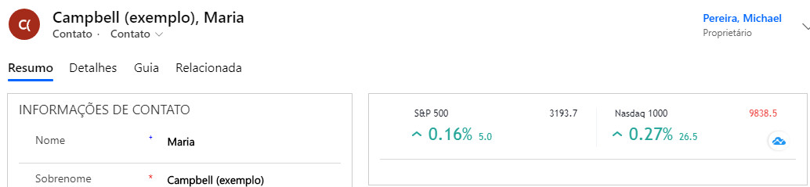
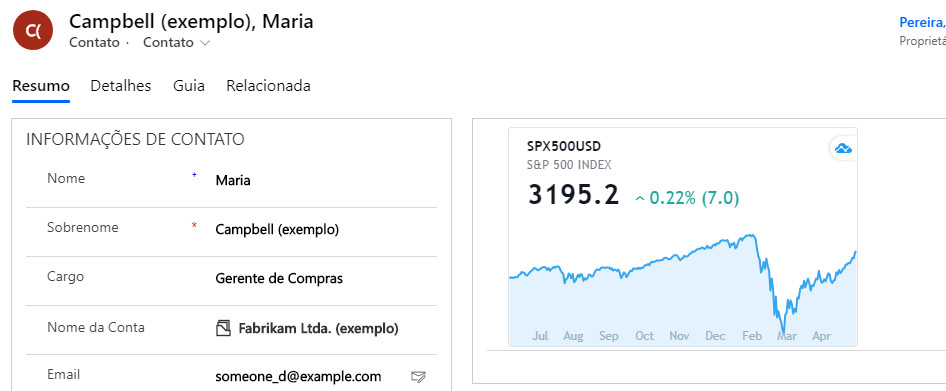

**Stocks and Forex Widget - Power Apps Component**

A Power Apps Componente to show assets that are negotiated on the many Stocks Eschanges around the world and Forex.

Ticker Component:

Mini chart component:

This component have those attributes:

| Attribute Name   | Description                                                                                                                              | Type   |
| ---------------- | ---------------------------------------------------------------------------------------------------------------------------------------- | ------ |
| **StockField**   | Field that will show the component                                                                                                       | string |
| **StockType**    | The type of component that would like to show: (0) Ticker (1) Mini Chart                                                                 | string |
| **StockItens**   | The codes of the assets to be shown. For ticker, you need to user semi-colon to separates the assets. Mini chart support only one asset. | string |
| **StringLocale** | Language to show the data: en,es,uk,pt-br                                                                                                | string |

This component is based on widgets from Tradeview ([http://www.tradeview.com](http://www.tradeview.com)). The codes of the assets that you will use need to be get from the Tradeview site.

If you need any assistance, please let me know.
